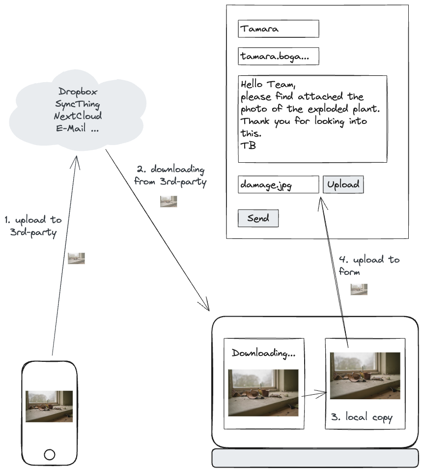
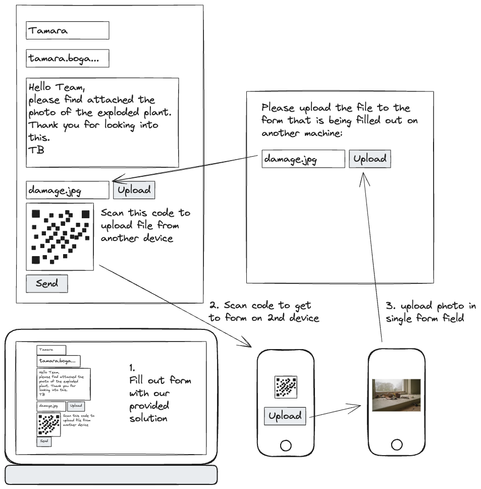

🤫 Psst! Did you know there is [a new homepage for the Flottform #Build-In-Public effort](https://flottform.io)? Click the headline below to jump to the post on the new site 🚚✨

# [Defining our mission: Improve Web Form File Uploads](https://flottform.io/updates/2023-10-23-defining-our-mission-improve-web-form-file-ploads)

Hello y’all!

[In our previous update](../2023-10-11%20Starting%20to%20build/README.md), we announced our exciting #BuildInPublic venture. We’ve mentioned our first product aimed at simplifying the upload of documents or images to web applications, especially when these files are on a secondary device, addressing a common UX challenge.

## The User Experience challenge

One of the comments we received was “[just use syncthing 🧐](https://www.linkedin.com/feed/update/urn:li:activity:7117825210694647808?commentUrn=urn%3Ali%3Acomment%3A%28activity%3A7117825210694647808%2C7118256757151293440%29&dashCommentUrn=urn%3Ali%3Afsd_comment%3A%287118256757151293440%2Curn%3Ali%3Aactivity%3A7117825210694647808%29)” for what we want to tackle. It's exactly this kind of community interaction that we cherish, as it opens the floor to deeper exploration and healthy debate. So, let's dive in!

Here is our hypothetical use case: Last week, Tamara bought a nice looking plant from an online shop for our office and put it on the shelf. After a few minutes of strange clicking noises, the plant suddenly exploded! Surely, she now wants to report this unexpected behavior of the plant and decides to send a message to the seller.

As she’s sitting in front of her laptop, she opens their contact form and fills out the necessary fields. Then, she sees that they allow photos to be uploaded. Providing one would definitely increase her chances of getting a replacement, so she let Jörn take a photo with his phone. Now, how do we continue? Does Jörn need to fill out the form on his phone again, with all of Tamara’s inputs? No way we’re typing all of that a second time! We should move the file from the phone to the computer instead. But how?

Sharing files across devices can be a hassle. Using SyncThing, NextCloud, Dropbox or something similar may solve this for you, if it is already set up to sync the necessary files. But if you don’t have such a setup: How do you securely share this photo? And how many steps are involved to share it?

See this short image of the typical workflow, when we want to attach a photo:

(Credit for the broken plant image: [Daniel Tafjord, @danieltafjord, 2017, via www.unsplash.com](https://unsplash.com/photos/broken-pot-near-mirror-9p7nBsrcCt0))

Now the flow we want to achieve is the roughly the following:

Tamara fills out the form until she gets to the file upload part. Jörn uses the file upload QR code to directly upload the photo to that specific form field. Instead of having to set up a third-party sharing provider, this works without having to set up additional apps or services on every involved device. Tamara sees the file in her form once it’s uploaded and can press the “Send” button.

With a contact form allowing such a workflow, we would be very happy customers: We have a quick way to report problems, upload files directly into a form from any device we want or need.

## How can this be done technically?

There are lots of ways to solve this technically, really. Reading the above ideas as a webmaster may let you think of creating an individual solution for your server by adding an extra provider or service into the mix already. While this may work out for a single application, this sounds like quite some work for individual developers. If we want to see these ideas widely adopted, we need to find an easy and generic solution.

Someone else may think of creating a browser extension that can open a form uploader for file fields whenever it sees one. To be fair, this is still better than having to set up an app on every device, but it still needs some knowledge and setup on the customer side.

From our perspective, we see the form builders in charge of improving the forms. At the same time, it seems to be technically challenging and involves changes to the server. The idea we’re about to explore lets us minimize this problem and makes it easy to improve existing forms. In our next discussion, we'll explore how utilizing latest web standards such as WebRTC can empower developers to effortlessly integrate this functionality into their forms.

## Next Up: Finding a name and prototype a solution

To wrap it up, our quest to simplify the file upload process addresses a common UX challenge. We aim to provide users with a seamless solution, eliminating the need to use third-party services, applications or extensions. We’re all about simplifying this process, and we’re diving into some cool web APIs to make it happen.

Join us on this exciting journey! Follow our progress, share your insights, or even challenge our approach - we’re here for it all. Connect with us on [LinkedIn](https://www.linkedin.com/company/compose-us/) and [Twitter / X](https://twitter.com/compose_us). Every comment, like, and share fuels our progress! If you want to share your thoughts and don’t know where to put them: Here is [a discussion for this blog post on GitHub](https://github.com/compose-us/build-in-public/discussions/2).

Cheers,

 and 
